# Secrets Management Vault

A centralised secrets management platform using HashiCorp Vault on AWS EKS, replacing static credentials with dynamic, short-lived secrets across database access, cloud IAM, TLS certificates, and application-layer encryption.

## Overview

Every production environment has the same problem: credentials scattered across environment variables, config files, and CI/CD secrets — all long-lived, broadly scoped, and difficult to audit. This project builds the infrastructure that eliminates that pattern entirely.

HashiCorp Vault runs in HA mode on EKS with Raft integrated storage and AWS KMS auto-unseal. Four secrets engines handle different credential types: the database engine generates unique PostgreSQL credentials per application instance, the AWS engine creates temporary IAM users on demand, the PKI engine acts as an internal certificate authority, and the transit engine provides encryption as a service without exposing keys. The Vault Secrets Operator syncs all of this into standard Kubernetes Secrets, so applications consume credentials through native Kubernetes mechanisms with zero Vault-specific code.

A Node.js demo application ties everything together — it connects to RDS using dynamic database credentials, holds short-lived AWS IAM keys, serves TLS certificates issued by Vault's internal CA, and encrypts data at rest through the transit engine. GitHub Actions pipelines authenticate to Vault via AppRole to retrieve deployment credentials, meaning no static AWS keys exist anywhere in CI/CD.

## Architecture

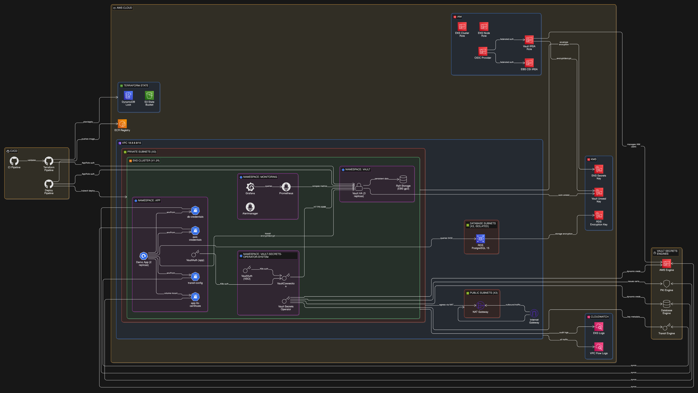

The platform runs inside a VPC with three subnet tiers: public (NAT gateway), private (EKS worker nodes), and isolated database subnets (no internet route). Vault deploys as a 3-replica HA cluster in its own Kubernetes namespace, with Raft consensus across availability zones and KMS-backed auto-unseal via IRSA.

The Vault Secrets Operator runs in a dedicated namespace and connects to Vault over internal TLS. It watches VaultDynamicSecret, VaultPKISecret, and VaultStaticSecret CRDs in the application namespace, pulling credentials from Vault's secrets engines and syncing them into Kubernetes Secrets. The demo application reads those secrets through standard `envFrom` and volume mount patterns — it has no Vault SDK dependency.

Prometheus scrapes Vault's `/v1/sys/metrics` endpoint via a ServiceMonitor, feeding a Grafana dashboard that tracks seal status, token counts, lease expirations, and Raft replication health. PrometheusRule alerts fire on conditions like sealed nodes, leader loss, and quorum degradation.

## Tech Stack

**Infrastructure**: AWS EKS, RDS PostgreSQL 15, KMS, VPC (3-tier subnets), Terraform (modular, S3 + DynamoDB state)

**Secrets Management**: HashiCorp Vault 1.15.4 (HA/Raft), Vault Secrets Operator 0.10.0

**Secrets Engines**: Database (PostgreSQL), AWS (dynamic IAM), PKI (internal CA), Transit (encryption as a service)

**Auth Methods**: Kubernetes (in-cluster workloads), AppRole (CI/CD pipelines)

**CI/CD**: GitHub Actions — Vault AppRole auth, ECR push, EKS deploy, tfsec, Trivy

**Monitoring**: Prometheus, Grafana, Alertmanager (kube-prometheus-stack)

**Security**: Non-root containers, read-only rootfs, capabilities dropped, NetworkPolicy, VPC flow logs, RDS forced SSL, KMS encryption at rest

## Key Decisions

- **Vault Secrets Operator over sidecar injector**: The older Agent Sidecar Injector adds a sidecar container to every pod. The Vault Secrets Operator uses CRDs to sync secrets into native Kubernetes Secrets, eliminating per-pod overhead and removing any Vault dependency from application code. This is HashiCorp's current recommended pattern.

- **AWS KMS auto-unseal over Shamir keys**: Manual unsealing with Shamir key shares requires operator intervention after every pod restart. KMS auto-unseal makes Vault operationally viable on Kubernetes where pods are ephemeral. The trade-off is a dependency on AWS KMS availability, which is acceptable given the entire platform runs on AWS.

- **HA Raft storage over standalone or Consul-backed**: A single Vault server is a tutorial. Consul adds operational complexity for a storage backend that Raft now handles natively. Raft integrated storage gives HA with automatic leader election while keeping the deployment self-contained within the Vault Helm release.

- **Transit engine for encryption as a service**: Vault isn't just a secret store — it's also an encryption platform. Including the transit engine demonstrates that pattern: the application sends plaintext and receives ciphertext without ever handling encryption keys. This separates cryptographic operations from application logic, which is the pattern that compliance teams expect.

## Screenshots

**Secrets Engines** — Six engines enabled: aws, database, pki, pki_int (intermediate CA), transit, and the default cubbyhole for per-token storage.

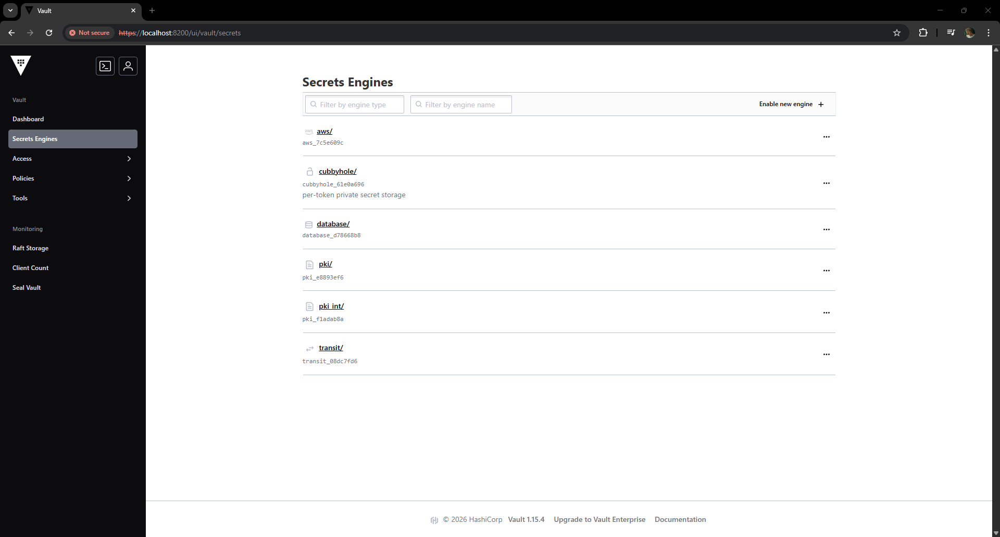

**Authentication Methods** — AppRole for CI/CD pipelines, Kubernetes for in-cluster workloads, and the default token auth method.

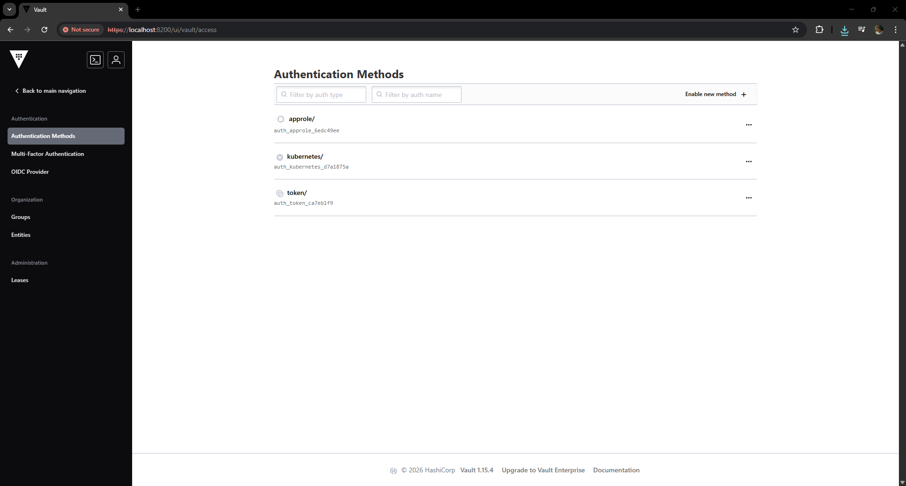

**Raft Storage Cluster** — Three-node Raft consensus cluster with vault-0 elected as leader and all nodes healthy as voters.

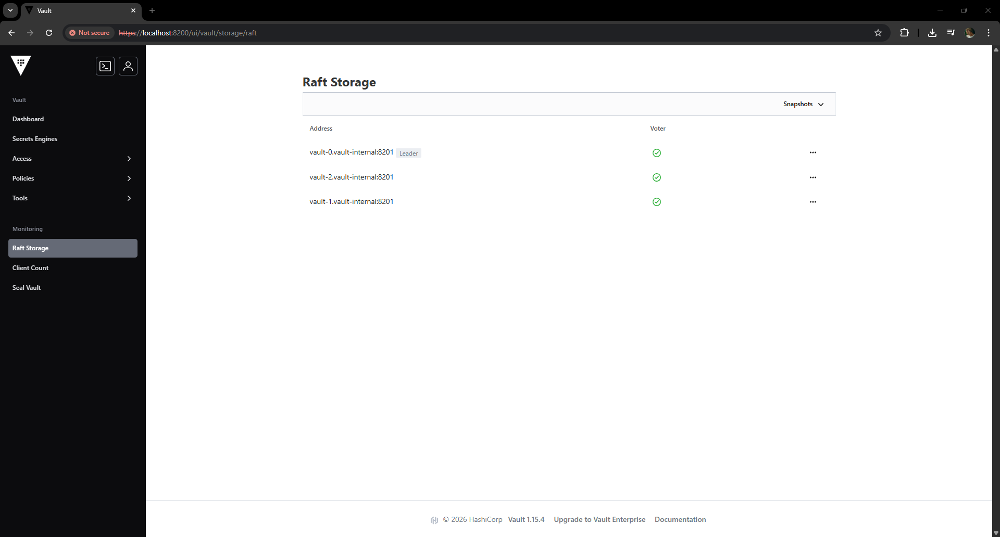

**ACL Policies** — Least-privilege policies scoped per engine: admin, app-full, aws-credentials, database-readonly, database-readwrite, pki-issue, and transit-encrypt.

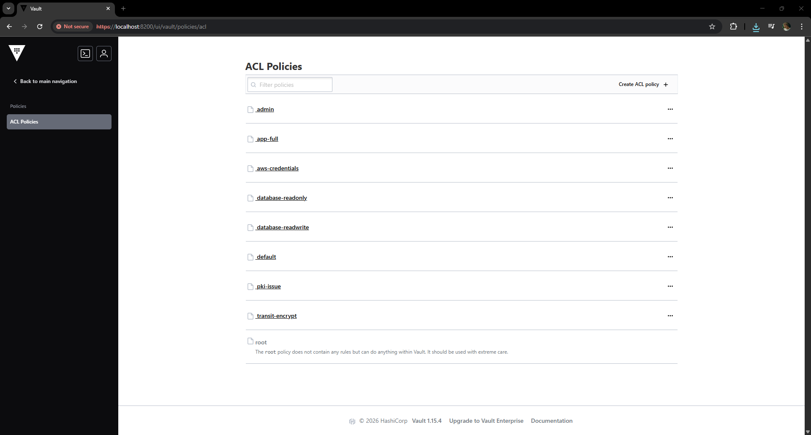

**Vault HA Pods** — Three Vault pods running across separate nodes in eu-west-2, each with 1/1 containers ready.

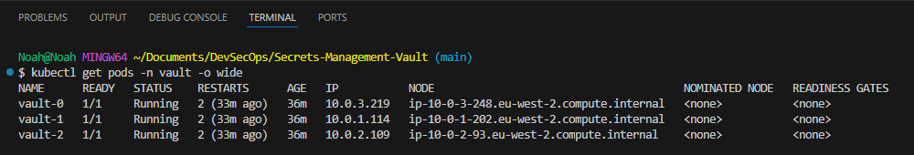

**Demo App Health Check** — Application health endpoint showing database connected to RDS, AWS credentials configured, TLS certificate mounted, and transit engine status.

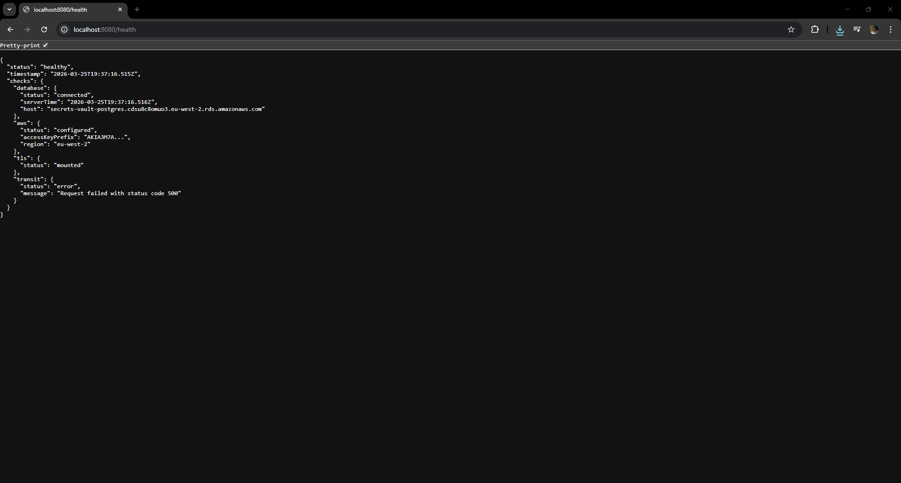

**Credential Summary** — Application introspection endpoint showing all four credential sources: dynamic database user, dynamic AWS IAM key, PKI-issued TLS certificate, and transit encryption key — all consumed via Kubernetes Secrets synced by VSO.

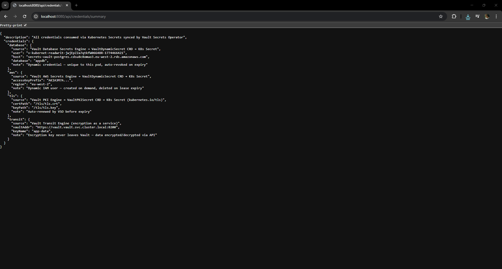

**VSO Synced Secrets** — Four Kubernetes Secrets in the app namespace created by the Vault Secrets Operator: app-tls-certificate, aws-credentials, db-credentials, and transit-config.

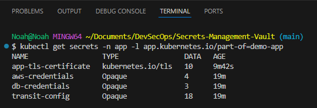

**Cluster Overview** — All pods running across vault, vault-secrets-operator-system, app, and monitoring namespaces including Prometheus, Grafana, and Alertmanager.

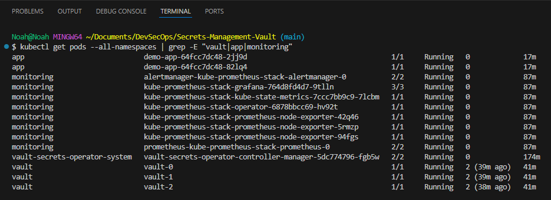

**Grafana Vault Dashboard** — Vault monitoring dashboard showing autopilot health, seal status, active nodes, Raft quorum, request and audit activity, memory utilisation, and replication latency.

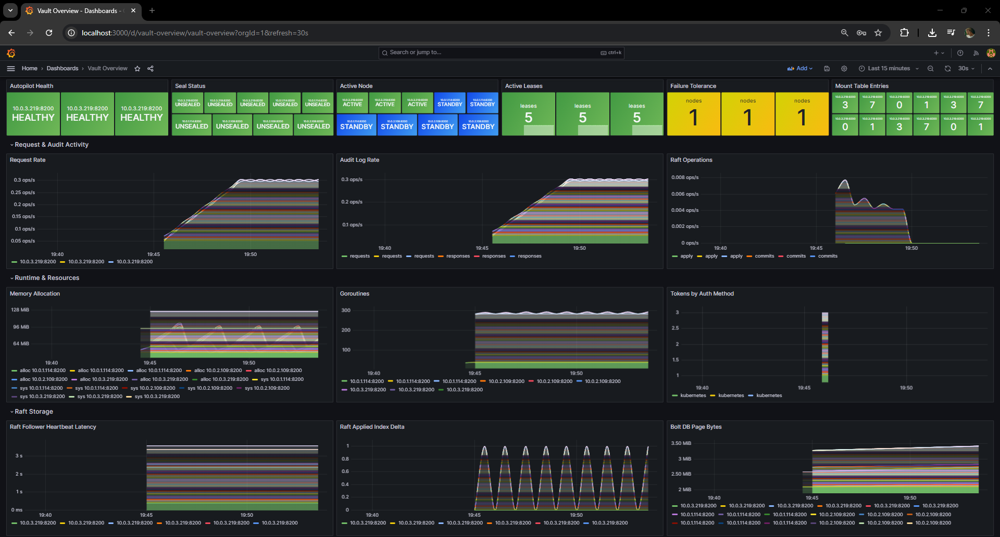

## Author

**Noah Frost**

- Website: [noahfrost.co.uk](https://noahfrost.co.uk)
- GitHub: [github.com/nfroze](https://github.com/nfroze)
- LinkedIn: [linkedin.com/in/nfroze](https://linkedin.com/in/nfroze)
